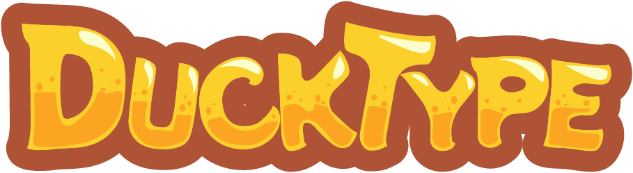
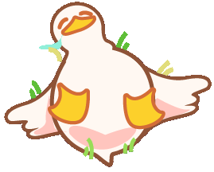
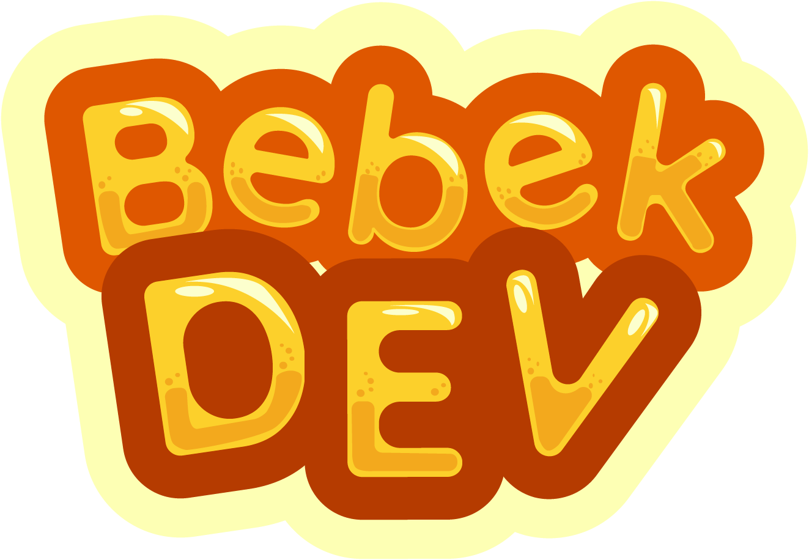

<h1>DuckType: a Duck Typing Game</h1>

<em>A simple, duck themed typing game.</em>

---

<!-- absolutely shameless README copy paste of our earlier game. by the way, while you're at it, check out or first game https://github.com/Gibekkk/GarudaKotak :v -->

## Play as Bucky the Duck

A swarm of angry goose is after him and he needs your help before they get to him! Type quickly and accurately to help Bucky smack the furious geese away and potential debries they may hurl at him. But I wonder.. What’s got all the geese riled up? Why are they so angry? Almost feels like someone is eating all of their food…

 

<!-- original "story" conjured by feli suppose to have bucky stole all the food from the geese camp. they were not happy. too bad there's not enough time to implement the story. -->

## Play Now
You can get the latest version of the game from the [release page](https://github.com/Oreo-1/Bebek-Kotak/releases).
..alternatively, you can play the online (but unstable) version through the link below.
https://oreo-1.github.io/Bebek-Kotak/

## Features
- 100% hand-drawn, no borrowed or AI generated image assets.
- Locally stored leaderboard.
- Global leaderboard (currently broken)
- Bucky

---

## Dev Team Overview

### Developer:
- Gilbert De Foucauld Winardy (Gibekkk)
- Aryo Karel Merentek (Oreo-1)
### Illustrator:
- Felicia Suyanto

proyek ini dibuat untuk lomba game IT Competition AMIKOM Surakarta 2025
<!-- spoilers: WE WON! AKASJDKASJDKJASD -->

 

made with ❤️ from the <s>GaruDev</s> BebekDev team

<!-- kodong demoted from the mighty Garuda into a mere duck -->

